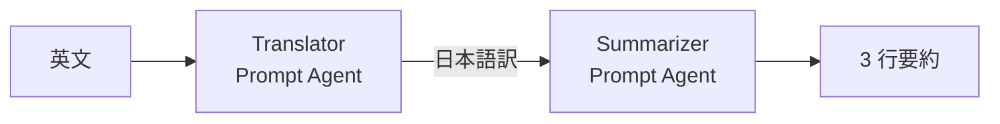

# STEP1: Prompt Agent + ワークフロー（翻訳 → 要約）

Microsoft Foundry ポータル（[https://ai.azure.com](https://ai.azure.com)）だけを使い、
**Prompt Agent を 2 つ作成 → ワークフローで連結 → ポータルのプレイグラウンドで実行** までを体験するハンズオンです。

> ローカル環境（VS Code、Python、`uv` など）は不要です。すべてブラウザ上で完結します。

## 学習ゴール

- Foundry ポータルから Prompt Agent を作成できる
- ポータルのワークフロー デザイナで複数のエージェントを直列に連結できる
- ワークフローのプレイグラウンドで動作確認できる

## 作るもの

| 名前 | 種別 | 役割 |
| --- | --- | --- |
| `Translator` | Prompt Agent | 英文を自然な日本語に翻訳する |
| `Summarizer` | Prompt Agent | 日本語の文章を箇条書き 3 行に要約する |
| `translate-summarize` | Workflow | `Translator` → `Summarizer` の順に呼び出す |



## 前提条件

リポジトリ直下の [README.md](../../README.md#前提条件) のセットアップが完了していること。
特に以下を確認してください。

- ブラウザで [https://ai.azure.com](https://ai.azure.com) から対象の Foundry プロジェクトを開けること
- プロジェクトに **チャット用モデル** がデプロイ済みであること（例: `gpt-5.4-mini`）

## 手順

### 1. Translator エージェントを作成する

1. [https://ai.azure.com](https://ai.azure.com) で対象プロジェクトを開く
2. 画面右上のトグルが **「新しい Foundry」** になっていることを確認
3. 上部メニュー **「ビルド」** → 左メニュー **「エージェント」** を選択
4. 右ビューの **「エージェント」** タブを選び、右上の **「エージェントの作成」** ボタンをクリック
5. 以下を設定:
   - **名前**: `Translator`
   - **モデル**: デプロイ済みのチャットモデル（例: `gpt-5.4-mini`）
   - **手順 (Instructions)**:

     ```text
     あなたは英日翻訳者です。入力された英文を、意味を変えずに自然で読みやすい日本語に翻訳してください。
     翻訳結果のみを出力し、前置き・解説・原文の再掲は一切付けないでください。
     ```

   - **ツール**: なし
6. **作成**（または **保存**）

> 既に「クラシック エージェント」を使っていた場合、上部の案内バーから新しいエクスペリエンスに切り替えてください。
> 本ハンズオンは **新しい Foundry** 前提です。

### 2. Summarizer エージェントを作成する

同じ手順で 2 つ目を作成します。

1. **「エージェント」** タブで **「エージェントの作成」**
2. 設定:
   - **名前**: `Summarizer`
   - **モデル**: 同じチャットモデルで OK
   - **手順 (Instructions)**:

     ```text
     あなたは要約アシスタントです。入力された日本語の文章を、重要なポイントだけを残して箇条書き 3 行に要約してください。
     出力は「- 」で始まる箇条書き 3 行のみとし、それ以外の文（見出し、前置き、補足）は出力しないでください。
     ```

3. **作成**

### 3. 個別に動作確認（推奨）

各エージェントのプレイグラウンドを開いて単体テストします。

- `Translator` に英文 1 段落を投げて、日本語訳だけが返ること
- `Summarizer` に長めの日本語を投げて、箇条書き 3 行だけが返ること

> ここで失敗していたら、ワークフローに進んでも必ず失敗します。
> **Instructions が想定通りか** をプレイグラウンドで詰め切ってから次に進んでください。

### 4. ワークフローを作成する

1. 同じ画面（**ビルド** → 左メニュー **エージェント**）で、右ビューの **「ワークフロー（プレビュー）」** タブに切り替える
2. 右上の **「作成」** ボタンを押すと、4 種類のメニューが表示されます:
   - **空白のワークフロー** … ゼロから組み立てる（**本リポジトリのハンズオンはすべてこれを使用**）
   - **順次** … シーケンシャル ワークフローのテンプレート（本 STEP1 と同じ用途）
   - **ヒューマン イン ループ** … HIL のテンプレート（同じ用途のハンズオンを [STEP3](../03-human-in-the-loop/README.md) で扱います）
   - **グループ チャット** … 複数エージェントの繰り返し会話のテンプレート（同じ用途のハンズオンを [STEP2](../02-quiz-review-loop/README.md) で扱います）

> 各テンプレートは **同じ目的のワークフローをすばやく作るための雛形** ですが、本リポジトリでは内部構造を 1 ノードずつ理解することを目的とするため、いずれの STEP でも **「空白のワークフロー」** から組み立てます。
3. ここでは **「空白のワークフロー」** を選択
4. **名前**: `translate-summarize`
5. デザイナで以下を構成します。左上の **「＋ 新しいノード」** を押すと「ワークフロー ノードを追加」パネルが開き、`呼び出す > エージェント` などから選べます。

   | ノード（日本語 UI） | YAML での `kind` |
   | --- | --- |
   | **呼び出す › エージェント** | `InvokeAzureAgent` |

   - **トリガー**: `OnConversationStart`（`Start` ノードが初期表示）
   - **アクション 1：呼び出す › エージェント**: エージェント = `Translator`
     - **Input.messages**: `=System.LastMessage.Text`
     - **Output.messages**: `Local.LastMessage`
     - **autoSend**: `false`（中間結果を会話に出さない）
   - **アクション 2：呼び出す › エージェント**: エージェント = `Summarizer`
     - **Input.messages**: `=Local.LastMessage`
     - **Output.messages**: `Local.LastMessage`
     - **autoSend**: `true`（最終結果のみ送信）
6. **保存**

> **テンプレート利用も検討**: 今回の構成は **「順次」** テンプレートとほぼ同じです。
> ハンズオン目的（各ブロックを 1 つずつ理解する）を踏まえ、本書では **空白のワークフロー** から組む手順にしています。

> YAML エディタに切り替えると、おおむね以下のような構造になります（実際にハンズオンで動作確認した参考 YAML）。
> `id:` は **ワークフロー内で一意である必要があり**、欠落や重複があると保存時にエラーになります。以下では分かりやすい固定 ID を振っています。
>
> ```yaml
> kind: workflow
> trigger:
>   kind: OnConversationStart
>   id: trigger_wf
>   actions:
>     - kind: InvokeAzureAgent
>       id: translator
>       agent:
>         name: Translator
>       conversationId: =System.ConversationId
>       input:
>         messages: =System.LastMessage.Text
>       output:
>         autoSend: false
>         messages: Local.LastMessage
>     - kind: InvokeAzureAgent
>       id: summarizer
>       agent:
>         name: Summarizer
>       conversationId: =System.ConversationId
>       input:
>         messages: =Local.LastMessage
>       output:
>         autoSend: true
>         messages: Local.LastMessage
> id: ""
> name: translate-summarize
> description: ""
> ```
>
> ポイント:
>
> - `id`（ワークフロー本体）と `name` は空文字でも保存できます（保存時にポータルが採番）。一方、各アクションの `id:` は **ワークフロー内で一意な文字列が必須** です。デザイナで組むと自動で `node-<タイムスタンプ>` のような値が振られますが、YAML 直貼り時は重複しないよう自分で命名するのが確実です。
> - 1 つ目の `output.autoSend: false` で **中間結果（日本語訳）を会話に出さず**、2 つ目の `autoSend: true` で **最終要約のみ送信** しています。
> - 入力式は `=System.LastMessage.Text`（`.Text` 必須）と `=Local.LastMessage` の組み合わせで、`Local.LastMessage` をバケツリレーします。

### 5. ワークフローを実行する

ワークフローのプレイグラウンドで、以下のサンプル英文を貼り付けて送信します。

```text
Microsoft Foundry is a unified platform that brings together models, agents, tools, and data so developers can build, evaluate, and deploy AI applications with built-in observability and governance. It supports both pro-code and low-code workflows across multiple languages.
```

期待される出力イメージ（要約 3 行のみ表示されること）:

```text
- Microsoft Foundry はモデル・エージェント・ツール・データを統合した AI 開発プラットフォーム
- 組み込みの可観測性とガバナンス付きで構築・評価・デプロイが可能
- プロコード / ローコードと複数言語に対応
```

うまく動かない場合は、下のトラブルシューティングを参照してください。

### 6. 別の英文でも試してみる

うまく動いたら、長さや題材を変えて挙動を観察します。

#### ② IT ニュース風（5 文）

```text
GitHub announced a new generation of Copilot that can plan, write, and review code across multiple files at once. The update introduces an agent mode that breaks down a high-level task into smaller steps and executes them with the developer's approval. It also adds deeper integration with pull requests, so Copilot can suggest fixes for failing checks automatically. Enterprise customers will get additional controls for audit logs, data residency, and model selection. The features will roll out in preview over the next few weeks and become generally available later this year.
```

#### ③ 技術解説（Azure Container Apps）

```text
Azure Container Apps is a serverless platform for running containerized workloads without managing the underlying Kubernetes cluster. It supports HTTP-driven autoscaling, event-driven scaling with KEDA, and scale-to-zero, which helps optimize cost for spiky traffic. Workloads can be deployed from a container image or directly from source code, and traffic can be split across multiple revisions for safe rollouts. Built-in Dapr integration provides service invocation, state management, and pub/sub messaging out of the box. For production scenarios, you can attach a virtual network, use managed identities, and stream logs to Azure Monitor.
```

## トラブルシューティング

| 症状 | 対処 |
| --- | --- |
| 翻訳結果に「以下が翻訳結果です」などの前置きが入る | `Translator` の Instructions を強める（「翻訳結果のみ・前置き禁止」を再強調） |
| 要約が 3 行を超える / 4 行以上になる | `Summarizer` の Instructions を「ちょうど 3 行・それ以外の文を出力しない」と明示 |
| ワークフローで何も返ってこない | Action の `agent.name` がエージェントの実名（`Translator` / `Summarizer`）と完全一致しているか確認（大文字小文字も） |
| 中間結果（日本語訳）まで会話に表示される | 1 つ目の Action の `autoSend` が `false` になっているか確認 |
| 入力が空になる | 1 つ目の Action の input が `=System.LastMessage.Text` になっているか確認（`.Text` の有無に注意） |

## クリーンアップ

ハンズオンが終わったらポータルから以下を削除してください（モデル呼び出し以外の課金は通常ありませんが、整理目的で）。

- ワークフロー `translate-summarize`
- エージェント `Translator` / `Summarizer`
- 検証用に作成した会話スレッド（任意）

## 次のステップ

- ツール（Bing Grounding / File Search / MCP）を追加した Prompt Agent を作る
- ワークフローに分岐（Condition）を追加して、入力が日本語なら翻訳をスキップする等の条件分岐を実装する
- 3 段以上のワークフロー（例: 翻訳 → 要約 → 英訳して逆翻訳の品質チェック）に拡張する
