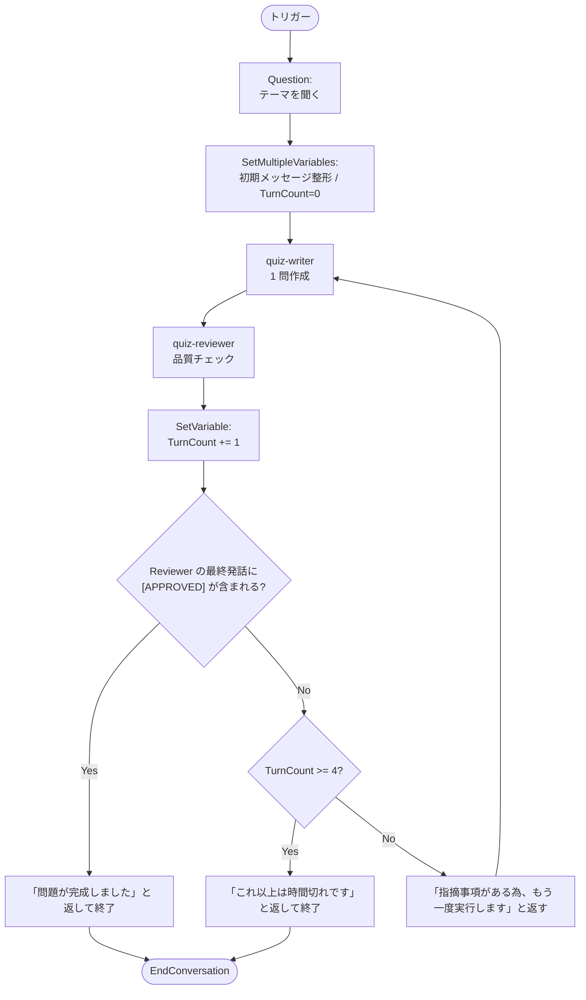

# STEP2: ループするワークフロー（問題作成 × レビュー）

「**問題作成エージェント（Writer）が 1 問作成 → レビューエージェント（Reviewer）が品質チェック → 合格なら確定 / 不合格なら修正指示を返して書き直し**」を、
2 つの Prompt Agent と **ループ（`GotoAction`）** で表現するハンズオンです。

題材は「**4 択クイズ問題**」という汎用的なものにしています。
社内研修、教材作成、製品 FAQ など、ご自身のユースケースに合わせて **Instructions と入力テーマを差し替えるだけ** で再利用できます。

ポイントは以下の 3 つです。

- 2 つのエージェントが **同じ会話履歴（`Local.LatestMessage`）** を共有してターン制で会話する
- **`ConditionGroup`**（フロー系）で「合格キーワード（`[APPROVED]`）が出たか」「ターン上限を超えたか」を判定する
- **`GotoAction`**（フロー系）で Writer に戻り、レビュー指摘を反映した書き直しループを構成する

このステップで主に学ぶのは、ノードカテゴリで言うと **データ変換系（`SetVariable`）** と **フロー系（`ConditionGroup` / `GotoAction`）** の使い方です。

## 学習ゴール

- 1 つのワークフローで複数エージェントを **多ターン会話** させ、品質ゲートを通すパターンを実装できる
- `SetVariable` でワークフロー内の状態（直近メッセージ、ターン カウンタなど）を保持できる
- `ConditionGroup` + `GotoAction` でループと終了条件を実装できる

## 作るもの

| 名前 | 種別 | 役割 |
| --- | --- | --- |
| `quiz-writer` | Prompt Agent | 与えられたテーマから 4 択クイズを **1 問** 作成する |
| `quiz-reviewer` | Prompt Agent | クイズの難易度・選択肢の妥当性・正解の一意性をチェック。OK なら `[APPROVED]`、NG なら具体的な修正指示を返す |
| `Quiz-Writer-Reviewer` | Workflow | Writer ⇄ Reviewer のレビュー ループ |



> このハンズオンの **Instructions・テーマは置き換え可能** です。
> 例: 「製品 FAQ の 1 問」「新人研修テスト 1 問」「コンプライアンス e-Learning の 1 問」など、
> Writer の出力フォーマットと Reviewer のチェック観点を書き換えれば、同じワークフロー構造でそのまま動きます。

## 前提条件

リポジトリ直下の [README.md](../../README.md#前提条件) のセットアップが完了していること。

## 手順

### 1. `quiz-writer` を作成する

1. [https://ai.azure.com](https://ai.azure.com) で対象プロジェクトを開き、**「新しい Foundry」** がオンになっていることを確認
2. 上部メニュー **「ビルド」** → 左メニュー **「エージェント」** → **「エージェント」** タブ → 右上の **「エージェントの作成」** をクリック
3. 設定:
   - **名前**: `quiz-writer`
   - **モデル**: デプロイ済みのチャットモデル（例: `gpt-5.4-mini`）
   - **手順 (Instructions)**:

     ```text
     あなたは学習用クイズの問題作成者です。
     入力には、出題したいテーマ（例:「日本の地理」「ビジネスマナー」「基本的なネットワーク用語」）が含まれます。
     直前にレビュアーからの修正指示が含まれている場合は、その指示を最優先で反映してください。

     必ず以下のフォーマットで「4 択クイズ」を 1 問だけ出力してください。
     前置き、解説、複数案は禁止です。

     ---
     【問題】
     <1 文で簡潔に問う>

     【選択肢】
     1. <選択肢>
     2. <選択肢>
     3. <選択肢>
     4. <選択肢>

     【正解】
     <番号>

     【解説】
     <60 字以内の日本語>
     ---
     ```

4. **作成**

### 2. `quiz-reviewer` を作成する

1. **「エージェント」** タブで再度 **「エージェントの作成」**
2. 設定:
   - **名前**: `quiz-reviewer`
   - **モデル**: 同じチャットモデルで OK
   - **手順 (Instructions)**:

     ```text
     あなたはクイズ問題のレビュアーです。直前に Writer が作成した 4 択クイズを 1 問受け取ります。

     以下の観点でチェックしてください。
     - 問題文: 簡潔で曖昧さがないか
     - 選択肢: 4 つすべてが同じカテゴリ・粒度で、不正解の選択肢が明らかに不自然でないか
     - 正解: 文脈上、正解が 1 つに定まるか（複数解釈の余地がないか）
     - 事実誤認・誤字脱字がないか
     - 文化的・倫理的に不適切な表現がないか

     判定ルール:
     - 問題なければ、講評を 1〜2 行述べたうえで、最後の行に必ず半角大文字で [APPROVED] とだけ書いてください。
     - 問題があれば、Writer がそのまま書き直せるよう、具体的な修正指示を箇条書きで返してください。この場合 [APPROVED] は絶対に出力しないでください。
     ```

3. **作成**

### 3. 個別に動作確認

各エージェントを **playground** で軽くテストします。

- `quiz-writer` に「日本の地理」と送り、上記フォーマットの問題が 1 問返ること
- `quiz-reviewer` に Writer が出した問題をそのまま貼り付けて、講評と `[APPROVED]` または修正指示が返ること
- わざと選択肢に同じ語を 2 つ含めるなど不備のある問題を投げると、`[APPROVED]` が **付かない** こと

> ここで `[APPROVED]` が安定して出ない／逆に何でも `[APPROVED]` してしまう場合、ループの終了条件が機能しません。
> Reviewer の Instructions を強めて（例: 「明確な不備が 1 つでもあれば必ず [APPROVED] を出さない」）から先に進んでください。

### 4. ワークフローを作成する

1. 同じ画面（**ビルド** → **エージェント**）で **「ワークフロー（プレビュー）」** タブに切り替える
2. 右上の **「作成」** ボタン → **「空白のワークフロー」** を選択
   - 参考: 「グループ チャット」テンプレートも、Writer × Reviewer のような繰り返しに使えます。本ハンズオンでは中身を理解するため空白から組みます。
3. **名前**: `Quiz-Writer-Reviewer`
4. **YAML エディタ** に切り替えて、以下を貼り付けます。

> **デザイナで組む場合のノード名対応表**（`＋ 新しいノード` から選択）
>
> | ノード（日本語 UI） | YAML での `kind` | 本ワークフローでの用途 |
> | --- | --- | --- |
> | **基本情報 › 質問する** | `Question` | 冒頭でユーザーに出題テーマを聞く |
> | **データ変換 › 複数の変数を設定** | `SetMultipleVariables` | 初期メッセージ整形と `TurnCount` の初期化（=0）をまとめて実施 |
> | **データ変換 › 変数の設定** | `SetVariable` | `TurnCount` をループのたびに `+1` |
> | **呼び出す › エージェント** | `InvokeAzureAgent` | `quiz-writer` / `quiz-reviewer` を呼ぶ |
> | **フロー › If / else** | `ConditionGroup` | `[APPROVED]` チェック / ターン上限チェック / それ以外（else）はループ |
> | **フロー › ノードに移動** | `GotoAction` | `else` 分岐から `writer_agent` に戻す |
> | **基本情報 › メッセージを配信** | `SendActivity` | 完了 / 時間切れ / リトライのユーザー向けメッセージ |
> | **基本情報 › 終了** | `EndConversation` | `[APPROVED]` 検出時 / 時間切れ時にワークフロー終了 |
>
> デザイナでも組めますが、コード量が多いため YAML 貼付けが手っ取り早いです。

> **コピペ時のポイント**: 各ノードの `id:` は **ワークフロー内で一意である必要** があります（重複や欠落があると保存時にエラーになります）。以下の YAML では分かりやすい固定 ID を振っています。

```yaml
kind: workflow
trigger:
  kind: OnConversationStart
  id: trigger_wf
  actions:
    - kind: Question
      id: ask_topic
      variable: Local.LatestMessage
      entity: StringPrebuiltEntity
      skipQuestionMode: SkipOnFirstExecutionIfVariableHasValue
      prompt: 出題したいテーマを 1 つ入力してください。例：「日本の地理」「ビジネスマナー」「基本的なネットワーク用語」
    - kind: SetMultipleVariables
      id: init_state
      assignments:
        - variable: Local.LatestMessage
          value: '=UserMessage("テーマ: " & Local.LatestMessage)'
        - variable: Local.TurnCount
          value: =0
    - kind: InvokeAzureAgent
      id: writer_agent
      agent:
        name: quiz-writer
      conversationId: =System.ConversationId
      input:
        messages: =Local.LatestMessage
      output:
        autoSend: true
        messages: Local.LatestMessage
    - kind: InvokeAzureAgent
      id: reviewer_agent
      agent:
        name: quiz-reviewer
      conversationId: =System.ConversationId
      input:
        messages: =Local.LatestMessage
      output:
        autoSend: true
        messages: Local.LatestMessage
    - kind: SetVariable
      id: inc_turn
      variable: Local.TurnCount
      value: =Local.TurnCount + 1
    - kind: ConditionGroup
      id: check_loop
      conditions:
        - id: cond_done
          condition: =!IsBlank(Find("[APPROVED]", Upper(Last(Local.LatestMessage).Text)))
          actions:
            - kind: SendActivity
              id: send_done
              activity: 問題が完成しました。終了します。
            - kind: EndConversation
              id: end_done
        - id: cond_turn_exceeded
          condition: =Local.TurnCount >= 4
          actions:
            - kind: SendActivity
              id: send_timeup
              activity: これ以上は時間切れです。レビューが通る問題を作成できませんでした。
            - kind: EndConversation
              id: end_timeup
      elseActions:
        - kind: SendActivity
          id: send_retry
          activity: 指摘事項がある為、もう一度実行します。
        - kind: GotoAction
          id: goto_writer
          actionId: writer_agent
id: ""
name: Quiz-Writer-Reviewer
description: ""
```

> **ポイント**
>
> - `Question` の `skipQuestionMode: SkipOnFirstExecutionIfVariableHasValue` により、ループ 2 周目以降は `Local.LatestMessage` にすでに値があるため質問をスキップします。
> - `SetMultipleVariables` で「テーマ整形」と「`TurnCount` の 0 リセット」を 1 ノードにまとめています。リトライ時の `GotoAction` は `writer_agent` に **直接** 戻るため、`init_state` ノードは **会話の最初の 1 回だけ通過** します（カウンタが途中で 0 に戻ることはありません）。
> - ループは `ConditionGroup` の `elseActions`（= どの条件にも該当しなかった場合）で `GotoAction` し、`writer_agent` に戻します。


5. **保存**

> デザイナで作る場合は、上記 YAML の各 `kind` を上の「ノード名対応表」に従って GUI ブロックに置き換えて並べます。
> ループの `GotoAction` は **「フロー › ノードに移動」** で、ターゲットに `writer_agent` を指定します。

### 5. ワークフローを実行する

ワークフローのプレイグラウンドを開いて会話を開始すると、まず **「出題したいテーマを 1 つ入力してください…」** という質問が表示されます。テーマを 1 つ入力してください。

```text
日本の地理
```

ほかにも以下のようなテーマを試すと、レビューループの挙動が観察しやすいです。

- `ビジネスマナー`
- `基本的なネットワーク用語`
- `料理の基礎知識`

期待される挙動:

1. ワークフローが **テーマを質問**（`Question`）し、ユーザがテーマを入力する
2. `quiz-writer` が指定フォーマットで 4 択問題を 1 問出す
3. `quiz-reviewer` が講評し、合格なら `[APPROVED]`、不合格なら修正指示を返す
4. 不合格の場合、`writer_agent` に戻って **修正指示を踏まえて書き直し** → 再度レビュー
5. `[APPROVED]` が含まれた時点でワークフロー終了
6. 4 ターン以内に通らなければ「これ以上は時間切れです。…」を返して終了

## 解説: 主要な式

| 式 | 役割 |
| --- | --- |
| `Question` ノードの `variable: Local.LatestMessage` + `skipQuestionMode: SkipOnFirstExecutionIfVariableHasValue` | 初回はテーマをユーザに質問して格納。ループ 2 周目以降はスキップして Writer に直行 |
| `=UserMessage("テーマ: " & Local.LatestMessage)` | テーマ文字列を、Writer に渡せるユーザメッセージ形式に整形（Power Fx の文字列リテラルは **ダブルクオート**） |
| `=0`（`SetMultipleVariables` 内 `Local.TurnCount`） | ループ開始前にカウンタを初期化 |
| `=Local.LatestMessage` | 直前の発話履歴（Writer / Reviewer が共有） |
| `=Local.TurnCount + 1` | レビュー往復回数のカウンタ加算 |
| `=!IsBlank(Find("[APPROVED]", Upper(Last(Local.LatestMessage).Text)))` | Reviewer の **最後の発話** に `[APPROVED]` が含まれるかを判定（大文字に統一して検索） |
| `ConditionGroup.elseActions` の `GotoAction` | どの条件にも該当しない＝まだレビュー指摘あり、の場合に `writer_agent` へループ |

## トラブルシューティング

| 症状 | 対処 |
| --- | --- |
| Writer が「テーマを指定してください」と聞き返す / Reviewer が問題を作り始める | 先頭の `Question` ノードを飛ばしてしまっている可能性。その次の `SetVariable` が `Local.LatestMessage` を参照しているか確認 |
| 4 ターンを超えてもループが止まらない | `Local.TurnCount` を加算する SetVariable の式が `=Local.TurnCount + 1` になっているか確認（`TurnCound` などのタイプミスだとカウンタが動かず、条件に該当しない） |
| ループが止まらない | Reviewer の Instructions に「明確な不備が 1 つでもあれば必ず [APPROVED] を出さない」「合格時は最終行に [APPROVED] のみ」を強めに書く |
| いつも 1 ターンで `[APPROVED]` が出る | Reviewer の判定基準が緩すぎる。観点（曖昧さ／選択肢／正解の一意性／事実誤認）を箇条書きで再強調し、「曖昧な点が 1 つでもあれば修正指示」と書く |
| `[APPROVED]` が出ているのに終了しない | 全角の `［APPROVED］` や小文字 `[approved]` になっていないか確認。条件式は `Upper(...)` で大文字化しているため `[approved]` でも一致するはずだが、全角はヒットしない |
| Writer が修正指示を無視する | Writer の Instructions の冒頭で「直前にレビュアーからの修正指示があれば最優先で反映」と書いているか確認 |
| エージェント名が解決できない | `agent.name` が `quiz-writer` / `quiz-reviewer` と完全一致しているか（大文字小文字、ハイフン含む）を確認 |

## クリーンアップ

- ワークフロー `Quiz-Writer-Reviewer`
- エージェント `quiz-writer` / `quiz-reviewer`

## 次のステップ

- Writer / Reviewer の Instructions を、ご自身のドメイン（社内研修、製品 FAQ、e-Learning など）に置き換えて再利用する
- 出題形式を「○×問題」「穴埋め」「短文記述」などに変えて、Reviewer のチェック観点を合わせて調整する
- 出題前に対象（学年・難易度・対象者）を `Question` ノードで選ばせて、Writer に渡す（[STEP3](../03-human-in-the-loop/README.md) と組み合わせ）
- レビュー往復のログを評価データとして保存し、[STEP4](../04-evaluation/README.md) で「Writer 単体の合格率」を測定する
