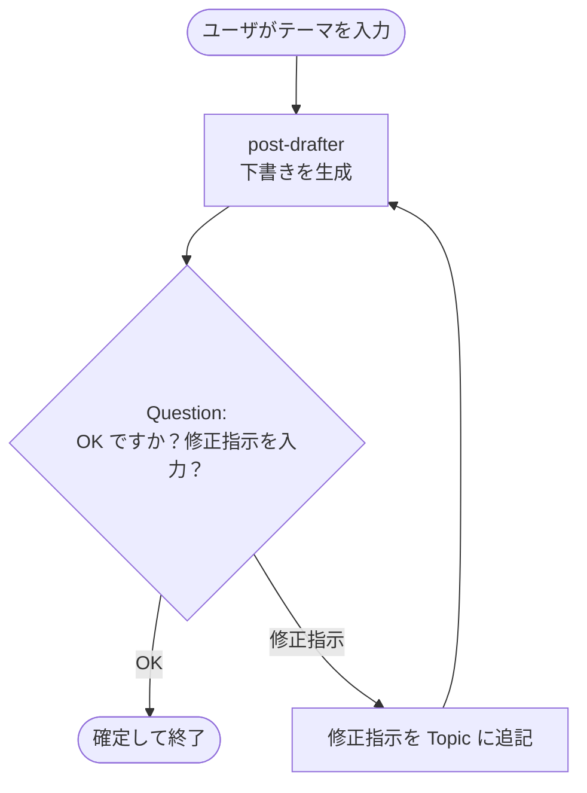

# STEP3: ヒューマン・イン・ザ・ループ（SNS 投稿レビュー）

AI が **SNS 投稿の下書きを生成 → 人がレビュー → OK なら確定 / NG なら修正指示を出して再生成** の流れを、
**`Question`** アクションと **`ConditionGroup` + `GotoAction`** で実装するハンズオンです。

## 学習ゴール

- ワークフローから **ユーザに質問してその回答を変数に格納** できる（`Question`）
- ユーザの回答に応じて分岐・ループを組める
- LLM の出力を **人間が承認してから確定** するパターンを体験する

## 作るもの

| 名前 | 種別 | 役割 |
| --- | --- | --- |
| `post-drafter` | Prompt Agent | テーマ（と修正指示）から SNS 投稿の下書きを 1 案生成 |
| `Demo-HIL-PostReview` | Workflow | 下書き生成 → ユーザレビュー → 確定 / 再生成のループ |



## 前提条件

リポジトリ直下の [README.md](../../README.md#前提条件) のセットアップが完了していること。

## 手順

### 1. `post-drafter` エージェントを作成する

1. [https://ai.azure.com](https://ai.azure.com) で対象プロジェクトを開き、**「新しい Foundry」** がオンになっていることを確認
2. 上部メニュー **「ビルド」** → 左メニュー **「エージェント」** → **「エージェント」** タブ → 右上の **「エージェントの作成」**
3. 設定:
   - **名前**: `post-drafter`
   - **モデル**: デプロイ済みのチャットモデル（例: `gpt-5.4-mini`）
   - **手順 (Instructions)**:

     ```text
     あなたは SNS 投稿のコピーライターです。
     入力にはテーマ（および任意で「修正指示」）が含まれます。

     ルール:
     - X (旧 Twitter) の 1 投稿として読みやすい長さ（140 文字以内）でまとめる
     - 1 投稿の本文のみを出力する（前置き、解説、複数案、ハッシュタグの羅列だけ などは禁止）
     - 修正指示が含まれている場合は、その指示を最優先で反映する
     ```

4. **作成**

### 2. 個別に動作確認

`post-drafter` のプレイグラウンドで以下のような入力を試します。

```text
テーマ: 来週月曜の社内 LT 大会の告知
```

期待: 1 投稿（〜140 文字）の本文だけが返ること。

```text
テーマ: 来週月曜の社内 LT 大会の告知
修正指示: もっとカジュアルに、絵文字を 1 つだけ
```

期待: トーンが変わり、絵文字が 1 つだけ入った 1 投稿が返ること。

### 3. ワークフローを作成する

1. 同じ画面（**ビルド** → **エージェント**）で **「ワークフロー（プレビュー）」** タブに切り替える
2. 右上の **「作成」** ボタン → **「空白のワークフロー」** を選択
   - 参考: 「ヒューマン イン ループ」テンプレートにも `Question` ブロックの最小例があります。中身を理解するため、本ハンズオンでは空白から組みます。
3. **名前**: `Demo-HIL-PostReview`
4. **YAML エディタ** に以下を貼り付け:

> **デザイナで組む場合のノード名対応表**（`＋ 新しいノード` から選択）
>
> | ノード（日本語 UI） | YAML での `kind` | 本ワークフローでの用途 |
> | --- | --- | --- |
> | **データ変換 › 変数の設定** | `SetVariable` | テーマ保存 / 修正指示をテーマに追記 |
> | **呼び出す › エージェント** | `InvokeAzureAgent` | `post-drafter` を呼んで下書き生成 |
> | **基本情報 › 質問する** | `Question` | ユーザーに OK / 修正指示を聞く |
> | **フロー › If / else** | `ConditionGroup` | OK か修正指示かを判定 |
> | **基本情報 › メッセージを配信** | `SendActivity` | 確定メッセージを表示 |
> | **基本情報 › 終了** | `EndConversation` | OK 時にワークフロー終了 |
> | **フロー › ノードに移動** | `GotoAction` | `drafter` に戻って再生成 |

> **コピペ時のポイント**: 各ノードの `id:` は **ワークフロー内で一意である必要** があります（重複や欠落があると保存時にエラーになります）。以下の YAML では分かりやすい固定 ID を振っています。

```yaml
kind: workflow
trigger:
  kind: OnConversationStart
  id: trigger_wf
  actions:
    - kind: SetVariable
      id: set_topic
      variable: Local.Topic
      value: =System.LastMessage.Text
    - kind: InvokeAzureAgent
      id: drafter
      agent:
        name: post-drafter
      conversationId: =System.ConversationId
      input:
        messages: =Local.Topic
      output:
        autoSend: true
        messages: Local.Draft
    - kind: Question
      id: question_review
      variable: Local.Decision
      entity: StringPrebuiltEntity
      skipQuestionMode: SkipOnFirstExecutionIfVariableHasValue
      prompt: この内容で投稿しますか？ そのままで良ければ "OK" と入力してください。修正したい場合は、修正指示を日本語で入力してください。
    - kind: ConditionGroup
      id: review_check
      conditions:
        - id: cond_ok
          condition: =Upper(Trim(Local.Decision)) = "OK"
          actions:
            - kind: SendActivity
              id: send_confirmed
              activity: |-
                ✅ 投稿を確定しました。

                {Last(Local.Draft).Text}
            - kind: EndConversation
              id: end_ok
      elseActions:
        - kind: SetVariable
          id: set_topic_with_feedback
          variable: Local.Topic
          value: '="テーマ: " & Local.Topic & " | 修正指示: " & Local.Decision'
        - kind: GotoAction
          id: goto_drafter
          actionId: drafter
id: ""
name: Demo-HIL-PostReview
description: ""
```

> **デザイナで作る場合の補足**: ハンズオン執筆時の検証では、`ConditionGroup` の OK 分岐は **GUI で条件を設定した後に YAML をエクスポートすると `condition:` フィールドが省略形でシリアライズされる** 場面がありました（GUI 上では条件式は保持されており、ランタイムも正しく分岐します）。挙動が怪しいときは、エクスポート YAML ではなくデザイナ側の条件設定を確認してください。

5. **保存**

### 4. ワークフローを実行する

ワークフローのプレイグラウンドで、テーマを送ります。

```text
来週月曜の社内 LT 大会の告知
```

期待される挙動:

1. `post-drafter` の下書き（1 投稿）が表示される
2. 続けて **質問 (`Question`)** が表示される: 「この内容で投稿しますか？...」
3. `OK` 以外を入力すると、それが **修正指示** として `Local.Topic` に追記され、`drafter` に戻って再生成
4. `OK` と入力すると、**最終確定メッセージ**（直前の下書き）が出てワークフロー終了

試しに以下のような会話をしてみてください。

| ターン | あなたの入力 | 期待される反応 |
| --- | --- | --- |
| 1 | `来週月曜の社内 LT 大会の告知` | 下書きが出る + 「OK ですか？...」と質問 |
| 2 | `もっとカジュアルに、絵文字を 1 つだけ` | 修正版の下書きが出る + 再質問 |
| 3 | `OK` | ✅ 投稿を確定しました。…で終了 |

## 解説: 主要な式

| 式 | 役割 |
| --- | --- |
| `=System.LastMessage.Text` | トリガーとなったユーザ発話のテキストを取得し `Local.Topic` に格納 |
| `=Local.Topic` | エージェント入力。文字列をそのまま渡しても、`InvokeAzureAgent` 側でユーザメッセージとして扱われます（明示したい場合は `=UserMessage(Local.Topic)` も可） |
| `'="テーマ: " & Local.Topic & " | 修正指示: " & Local.Decision'` | テーマ文字列に修正指示を連結。Power Fx の文字列リテラルは **ダブルクオート** |
| `Local.Draft` | drafter の最後の出力（メッセージリスト）を保持 |
| `Last(Local.Draft).Text` | メッセージリストの **最後の発話** からテキスト本体を取り出す |
| `=Upper(Trim(Local.Decision)) = "OK"` | ユーザの回答を大文字化・前後空白除去して `OK` 完全一致で判定 |
| `actionId: drafter` | `GotoAction` のジャンプ先（再生成のループ戻り先） |

## トラブルシューティング

| 症状 | 対処 |
| --- | --- |
| `OK` と入力しても再生成されてしまう | 全角の `ＯＫ` や `Ok 。` などになっていないか確認。条件式を `Find("OK", Upper(Trim(Local.Decision)))` ベースに緩めてもよい |
| `Error: Unexpected characters / Undefined identifier` が condition や value で出る | Power Fx の記法ミスをチェック: (1) 式の先頭に `=` があるか (2) 等号は **シングル `=`**（`==` は不可） (3) **文字列リテラルはダブルクオート `"..."`**（シングルクオートは識別子区切り） (4) 式の中で `{Local.X}` と書かない（`{ }` は `SendActivity.activity` / `Question.prompt` の **文字列補間専用**） |
| 修正指示がエージェントに伝わっていない | `set_topic_with_feedback` の式が **else 側** に入っているか、`agent.name` が `post-drafter` と一致しているか確認 |
| 質問が表示されずすぐ終わる | `Question` の `skipQuestionMode` の値を確認。`SkipOnFirstExecutionIfVariableHasValue` は **初回のみ** スキップ判定（ループ 2 周目以降は毎回質問する）。常にスキップされてしまう場合は `Always` 指定になっていないか確認 |
| 下書きが 140 文字を大きく超える | `post-drafter` の Instructions に「140 文字以内・絵文字含む」を再強調 |

## クリーンアップ

- ワークフロー `Demo-HIL-PostReview`
- エージェント `post-drafter`

## 次のステップ

- 修正回数に上限を設けて、超えたら諦めて終了する分岐を追加する（[STEP2](../02-quiz-review-loop/README.md) と組み合わせ）
- 投稿先を選ばせる `Question`（X / LinkedIn / 社内 Slack）を追加し、媒体ごとに `post-drafter` の Instructions を切り替える
- 確定後にもう 1 つのエージェント（例: `compliance-checker`）を呼んで NG ワードチェックする
